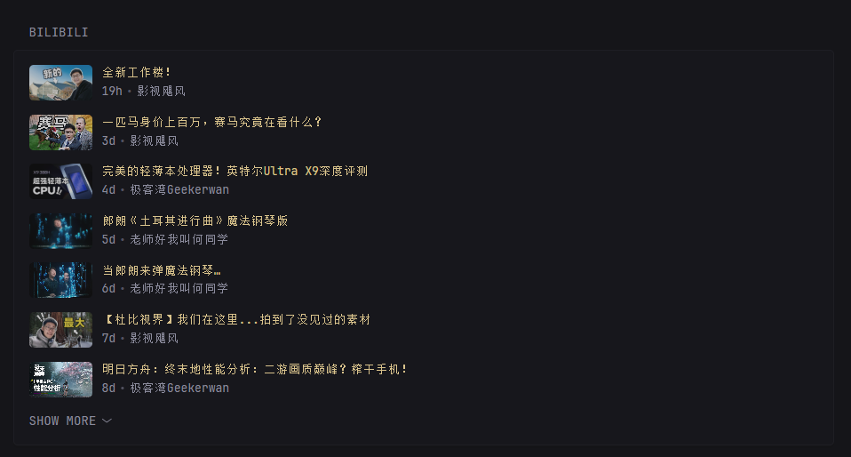

<p align="center">
  <h1 align="center">🎬 glance-bilibil</h1>
  <p align="center">
    一个为 <a href="https://github.com/glanceapp/glance">Glance</a> 开发的 Bilibili 视频汇总展示插件
    <br />
    <a href="./README.md">English</a> · <a href="#-快速开始">快速开始</a> · <a href="https://github.com/glanceapp/glance">Glance</a>
  </p>
</p>

<p align="center">
  <a href="https://github.com/Cynosure159/glance-bilibil/actions/workflows/ci.yml">
    
  </a>
</p>

<p align="center">
  
  
</p>

## 📸 预览

### 轮播卡片 (默认)


### 网格布局


### 垂直列表



## ✨ 功能特性

- 👤 **多 UP 主支持**：通过 `config.json` 轻松配置多个感兴趣的 UP 主。
- 🕒 **按时间轴汇总**：自动获取所有配置 UP 主的视频，并按发布时间全局排序。
- 🛡️ **稳定风控绕过**：实现 WBI 签名、动态 `buvid` 获取及 `dm` 参数模拟，绕过 B 站防爬虫机制。
- 🎨 **多种显示样式**：支持轮播 (Default)、网格 (Grid) 和垂直列表 (Vertical List)。
- ⚙️ **配置灵活**：支持配置文件及 URL 参数即时覆盖设置。
- ⚡ **性能优化**：
  - HTTP 连接池复用，减少 TCP 握手开销
  - Worker Pool 并发控制（默认 10 workers），防止资源耗尽
  - 智能重试策略，自动应对网络抖动

## 🚀 快速开始

### 1. 准备配置
在项目根目录创建 `config/config.json`:
```json
{
  "channels": [
    { "mid": "946974", "name": "影视飓风" },
    { "mid": "163637592", "name": "老师好我叫何同学" },
    { "mid": "25876945", "name": "极客湾Geekerwan" }
  ]
}
```

### 2. Docker 部署（推荐）

#### 使用 Docker Run
```bash
docker run -d \
  --name glance-bilibil \
  -p 8082:8082 \
  -v $(pwd)/config:/config \
  cynosure159/glance-bilibili:latest
```

#### 使用 Docker Compose
创建 `docker-compose.yml`:
```yaml
version: '3.8'

services:
  glance-bilibil:
    image: cynosure159/glance-bilibili:latest
    container_name: glance-bilibil
    ports:
      - "8082:8082"
    volumes:
      - ./config:/config
    restart: unless-stopped
```

启动服务：
```bash
docker-compose up -d
```

### 3. 本地编译运行
```bash
go build -o glance-bilibil .
./glance-bilibil -config config/config.json -port 8082 -limit 25
```

### 4. 从源码构建 Docker 镜像
```bash
# 构建镜像
docker build -t glance-bilibil .

# 运行容器
docker run -d \
  --name glance-bilibil \
  -p 8082:8082 \
  -v $(pwd)/config:/config \
  glance-bilibil
```
## 🔗 Glance 集成

在你的 `glance.yml` 中添加以下扩展配置：

```yaml
- type: extension
  url: http://localhost:8082/
  allow-potentially-dangerous-html: true
  cache: 5m
```

## 📡 API 接口
- `GET /` : 渲染后的视频列表 HTML (供 Glance 嵌入)
  - `limit`: 显示视频数量 (默认: 25)。
  - `style`: 显示样式: `horizontal-cards` (默认), `grid-cards`, `vertical-list`。
  - `mid`: 临时指定单个 UP 主 MID 进行过滤。
  - `cache`: 缓存时间（秒），默认 300s（5分钟）。设置为 0 禁用。
  - `collapse-after`: 垂直列表在 N 个项目后折叠 (默认: 7)。
  - `collapse-after-rows`: 网格布局在 N 行后折叠 (默认: 4)。
- `GET /json` : 聚合后的视频原始数据 (JSON)
- `GET /help` : 使用说明与当前配置详情

## 🏗️ 系统架构

本项目采用分层设计以确保可维护性：
- **API 层**: `internal/api/handler.go` - HTTP 路由与处理。
- **服务层**: `internal/service/video_service.go` - 并发汇总与排序算法。
- **平台层**: `internal/platform/bilibili.go` - Bilibili API 客户端与 WBI 签名。

## 📄 许可证

MIT License - 详情请参阅 [LICENSE](LICENSE) 文件。

## 🙏 致谢

- [Glance](https://github.com/glanceapp/glance) - 出色的自托管仪表板
- 灵感来源于 Glance 内置的 Videos 小组件
